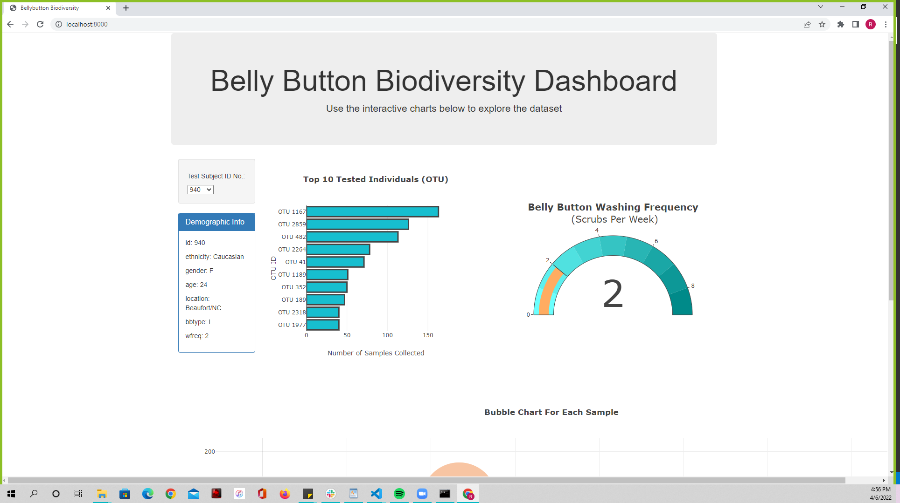
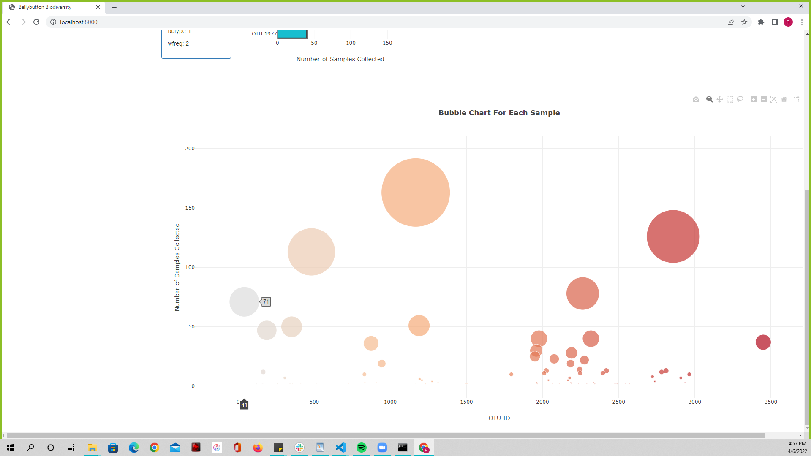
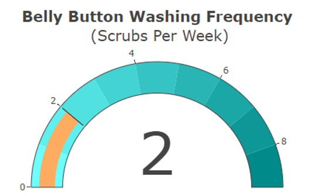

# Plot.ly Homework - Belly Button Biodiversity

In this assignment, you will build an interactive dashboard to explore the [Belly Button Biodiversity dataset](http://robdunnlab.com/projects/belly-button-biodiversity/), which catalogs the microbes that colonize human navels.

The dataset reveals that a small handful of microbial species (also called operational taxonomic units, or OTUs, in the study) were present in more than 70% of people, while the rest were relatively rare.

## Step 1: [Plotly](StarterCode/static/js/app.js)
For this step we were tasked with taking our JSON format [data](data/samples.json) and feeding it into a dashboard to be able to interact with the data in a more meaningful way.

## [Advanced Challenge Assignment (Optional)](StarterCode/static/js/bonus.js)

The following task is advanced and therefore optional.

* Adapt the Gauge Chart from <https://plot.ly/javascript/gauge-charts/> to plot the weekly washing frequency of the individual.

* You will need to modify the example gauge code to account for values ranging from 0 through 9.

* Update the chart whenever a new sample is selected.

## Deployment
Once completed use [this]() to navigate over to the live website where you can interact with the dashboard.

- - -

## References

Hulcr, J. et al.(2012) _A Jungle in There: Bacteria in Belly Buttons are Highly Diverse, but Predictable_. Retrieved from: [http://robdunnlab.com/projects/belly-button-biodiversity/results-and-data/](http://robdunnlab.com/projects/belly-button-biodiversity/results-and-data/)

- - -
